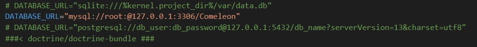

<div id="top"></div>

<!-- PROJECT SHIELDS -->
[![Contributors][contributors-shield]][contributors-url]
[![Forks][forks-shield]][forks-url]
[![Stargazers][stars-shield]][stars-url]
[![Issues][issues-shield]][issues-url]
[![MIT License][license-shield]][license-url]


<!-- PROJECT LOGO -->
<br />
<div align="center">
    

  <h3 align="center">Projet Comeleon</h3>

  <p align="center">
    <a href="https://github.com/RomainRamanzin/Projet_Comeleon/issues">Signaler un Bug</a>
    ·
    <a href="https://github.com/RomainRamanzin/Projet_Comeleon/issues">Demander une nouvelle fonctionnalité</a>
  </p>
</div>


<!-- TABLE OF CONTENTS -->
<details>
  <summary>Sommaire</summary>
  <ol>
    <li>
      <a href="#Presentation">Présentation</a>
      <ul>
        <li><a href="#Contexte">Contexte</a></li>
        <li><a href="#Projet">Projet</a></li>
	<li><a href="#Technologie">Technologies Utilisées</a></li>
      </ul>
    </li>
    <li>
      <a href="#Installation">Installation</a>
      <ul>
        <li><a href="#Prerequis">Les Prérequis</a></li>
        <li><a href="#Importation">Importation du projet</a></li>
        <li><a href="#Configuration">Configuration</a></li>
        <li><a href="#Importation">Importer la base de données</a></li>
      </ul>
    </li>
    <li><a href="#Utilisation">Utilisation</a></li>
    <li><a href="#contact">Contact</a></li>
    <li><a href="#Images">Les Images</a></li>
  </ol>
</details>


<!-- Contexte -->
## Contexte

[![Product Name Screen Shot][product-screenshot]](Images/accueil.png)

L’agence Comeleon propose ces services dans la création de site, application, à l’acquisition de nouveaux clients via les moteurs de recherche et les réseaux sociaux, elle accélère le business sur internet.

Dans ce projet, nous travaillons dans cette société dans le service ‘création de site’, notre équipe est constitué de 3 membres.

<p align="right">(<a href="#top">Retour en haut</a>)</p>


### Projet

Mr. X, désire augmenter sa visibilité sur internet pour booster son business. Cela devient impossible pour un entrepreneur de ne pas avoir de site en ligne.
Il désire avoir un site moderne avec un style qui correspond à son activité.

Il désire un site, accessible et ergonomique pour présenter son activité, que les clients puissent laisser des avis(dtb), consulter ses différentes prestations (dtb) et avoir un formulaire de contact. 

Notre équipe a été chargée de réaliser ce projet pour un Blombier Chauffagiste.

<p align="right">(<a href="#top">Retour en haut</a>)</p>


### Technologie

L'ors de la réalisation de ce projet, nous avons utilisées différentes technologies :

* [Symfony 5](https://symfony.com/)
* [BootStrap 5](https://getbootstrap.com/)
* [PHP 7](https://www.php.net/)
* [Twig](https://twig.symfony.com/)

<p align="right">(<a href="#top">Retour en haut</a>)</p>


<!-- Installation -->
## Installation

Afin de pouvoir visualiser et utiliser notre projet, il est neccessaire de proceder à quelques actions :

### Prérequis

Dans un premier temps, nous aurons besoin de Symfony 5 

* Téclécharger Symfony sur [symfony.com](https://symfony.com/download)

Ensuite, nous aurons besoin d'une version de PHP 7 au minimum

* Téclécharger PHP 7 sur [php.net](https://www.php.net/downloads)
*Vous pouvez verifier l'instalation en entrant la commande 
```sh
  php -v 
  ```


Nous auron besoin du manager de dépendance Composer

* Téclécharger composer sur [getcomposer.org](https://getcomposer.org/download/)

Pour finir, nous aurons besoin d'un serveur de base de données (ici wampserver)
* Téclécharger WampServer sur [wampserver.com](https://www.wampserver.com/)


### Importation du projet

1. Cloner le repository
   ```sh
   https://github.com/RomainRamanzin/Projet_Comeleon.git
   ```

<p align="right">(<a href="#top">Retour en haut</a>)</p>


### Configuration

Penssez à bien lancer WampServer lors de la configuration de la base !

Modifiez les informations de connexion à la base de données dans '.env'



### Importer la base de données

Pour creer la base de données veillez entrer :

```sh
   symfony console doctrine:database:create
```

Une fois la base créée, nous allons importer les tables

```sh
   symfony console doctrine:migrations:migrate
```

Pour en finir avec la base de données, nous allons impoerter les jeux d'essais réalisés

```sh
   symfony console doctrinefixture:load
```


<!-- Utilisation -->
## Utilisation

Le projet est constitué de différentes pages :

* une page d'accueil 
* une page de présentation
* une page contenant les différentes prestations proposées
* une page avec tous les avis postés
* une page de contact


Vous pouvez créer un compte et ensuite vous connecter sur le site avec les memes identifiants

Par défaut, toutes personnes connectés ont la possibilité d'effectuer des modification sur le site web.

<p align="right">(<a href="#top">Retour en haut</a>)</p>


<!-- CONTACT -->
## Contact

Romain Ramanzin - [@Romain-Ramanzin](https://www.linkedin.com/in/romain-ramanzin-051698202/) - romain.ramanzin@gmail.com

Lien du projet : [https://github.com/RomainRamanzin/Projet_Comeleon](https://github.com/RomainRamanzin/Projet_Comeleon)

<p align="right">(<a href="#top">Retour en haut</a>)</p>


